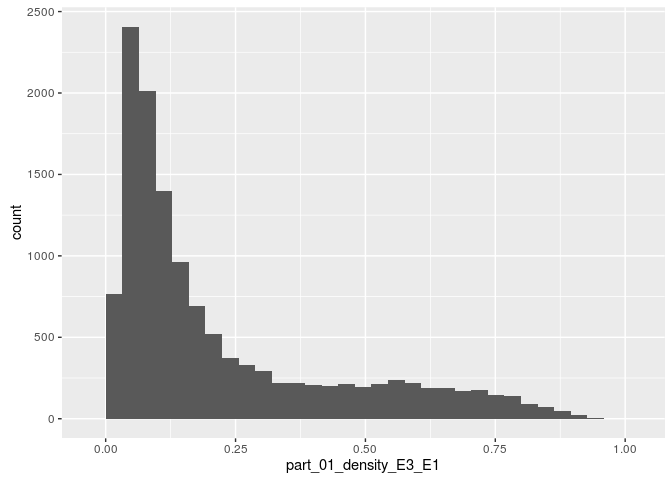

# Analiza ligand
Stanley Hardt  
`r format(Sys.time(), '%d.%m.%Y')`  
1. Wykorzystane biblioteki
---

```r
  library(dplyr)
  library(knitr)
  library(ggplot2)
  library(reshape2)
  library(cluster)
  library(caret)
```
2. Powtarzalność raportu
---

```r
  set.seed(23)
```
3. Wczytanie danych
---

```r
  # Załadowanie tabeli bez wykorzystania utworzonych klas
  dane <- read.table("~/Pobrane/all_summary.txt", skip = 0, header = TRUE, sep = ";")
  
  df<-as.data.frame.matrix(dane) 
```
4. Usuwanie wierszy z okreslonymi wartosciam res_name
---

```r
  df_bez <- filter( df, !(res_name %in% c("DA","DC","DT", "DU", "DG", "DI","UNK", "UNX", "UNL", "PR", "PD", "Y1", "EU", "N", "15P", "UQ", "PX4", "NAN")))%>% 
       filter(!is.na(res_name)) %>%
       filter(!is.nan(res_name))
```
5. Pozostawienie wierszy z unikatowymi wartosciami pdb_code i res_name
---

```r
  df_unique <- distinct(df_bez, pdb_code, res_name)
```
6. Podsumowanie kolumn
---

```r
  tabela_summary <- summarise(df_unique,
              pdb_count = n_distinct(pdb_code),
              pdb_min = mean(pdb_code),
              pdb_max = mean(pdb_code),
              pdb_mean = mean(pdb_code),
              res_count = n_distinct(res_name),
              res_min = mean(res_name),
              res_max = mean(res_name),
              res_mean = mean(res_name)  
            )
  kable(tabela_summary)
```


 pdb_count   pdb_min   pdb_max   pdb_mean   res_count   res_min   res_max   res_mean
----------  --------  --------  ---------  ----------  --------  --------  ---------
      7308        NA        NA         NA        2684        NA        NA         NA

7. Korelacja między zmiennymi
---

```r
  # funkcja układająca macierz wg wartości
  reorder_cormat <- function(cormat){
    dd <- as.dist((1-cormat)/2)
    dd[is.na(dd)] <- 2
    hc <- hclust(dd)
    cormat <-cormat[hc$order, hc$order]
  }
  
  # wybranie kolumn, ktorych korelacja potencjalnie nas moze zainteresowac
  clear_df <- select(df_unique, one_of(c("local_volume", "local_electrons", "local_mean" ,"local_std", "local_max", "local_skewness","local_parts")))
  cor_df <- cor(clear_df, use="complete.obs")
  
  # przeorganizowanie zmiennych wg wartosci korelacji
  cor_df <-reorder_cormat(cor_df)
  
  # wybranie dolnego trojkata
  cor_df[upper.tri(cor_df)]<- NA
  cor_df <- melt(cor_df,  na.rm = TRUE)
  
  wykres_korelacji <- ggplot(cor_df, aes(x =  Var1, y = Var2 , fill=value)) + 
    geom_raster() +
    scale_fill_gradient2(low = "blue", high = "red", mid = "white", 
                         midpoint = 0, limit = c(-1,1), space = "Lab", name="Korelacja") +
    theme_minimal() + 
    theme( 
      axis.title.x = element_blank(),
      axis.title.y = element_blank(),
      panel.grid.major = element_blank(),
      panel.border = element_blank(),
      panel.background = element_blank(),
      axis.ticks = element_blank(),
      legend.justification = c(1, 0),
      legend.position = c(0.6, 0.7),
      legend.direction = "horizontal") +
    theme(
      axis.text.x = element_text(angle = 45, vjust = 1, size = 12, hjust = 1)) + 
    coord_fixed() +
    guides(fill = guide_colorbar(barwidth = 7, barheight = 1,
                title.position = "top", title.hjust = 0.5)) +
    geom_tile(color = "white")
  
  wykres_korelacji
```


8. Określenie ile przykładów ma każda klasa(res_name)
---

```r
  tabela_res <- group_by(df_unique, res_name)
  tabela_res <- summarise(tabela_res, wystapienia = n()) %>%
    arrange(desc(wystapienia))
  
  kable(head(tabela_res,15))  
```


res_name    wystapienia
---------  ------------
SO4                1183
ZN                  849
GOL                 778
CA                  661
MG                  402
CL                  400
NAG                 396
PO4                 301
HEM                 296
EDO                 274
MN                  182
ACT                 167
FAD                 157
ADP                 138
FE                  120

9. Wykres rozkladow liczby atomów i elektronów
---

```r
  # Wyliczenie rozkladu atomow
  rozklad_atomow <- select(df_unique, local_res_atom_non_h_count) %>%
                    group_by(local_res_atom_non_h_count) %>%
                    summarise(wystapienia=n())
  
  wykres_rozkladow_atomow <- ggplot(rozklad_atomow, 
                                    aes(x = local_res_atom_non_h_count , y = wystapienia)) + 
    geom_bar(stat = "identity", position = "identity", size = 0.2)
  
  wykres_rozkladow_atomow
```


```r
  # Wyliczenie rozkladu elektron
  rozklad_elektronow <- select(df_unique, local_res_atom_non_h_electron_sum) %>%
                    group_by(local_res_atom_non_h_electron_sum) %>%
                    summarise(wystapienia=n())
  
  
  wykres_rozkladu_elektronow <- ggplot(rozklad_elektronow, 
                                    aes(x = local_res_atom_non_h_electron_sum , y = wystapienia)) + 
    geom_bar(stat = "identity", position = "identity", size = 0.2)
  
  wykres_rozkladu_elektronow
```


10. Odtworzenie wykresu
---

```r
  wykres_rozkladu_atomow_i_elektronow <- ggplot(df_unique, 
                      aes(x = local_res_atom_non_h_electron_sum , y = local_res_atom_non_h_count)) +
    stat_density2d(geom = "tile", aes(fill = ..density..), contour = FALSE ) +
    theme_bw() + 
    scale_fill_gradientn(
      colours =  c( "#6930A9","#72D39D","#F8FFA9","#A10045"), 
      na.value =  "#6930A9") + 
    scale_x_continuous(breaks = seq(100,601,100)) + 
    scale_y_continuous(breaks = seq(20,101,20)) + 
    coord_fixed(ratio = 4.5, xlim = c(0,650), ylim = c(0,100)) +
    theme( 
          axis.title.x = element_blank(),
          axis.title.y = element_blank(),
          legend.position = "none")
  
  wykres_rozkladu_atomow_i_elektronow <- ggExtra::ggMarginal(wykres_rozkladu_atomow_i_elektronow, type = "histogram", margins = "both", size = 5, col = 'black', fill = 'red', binwidth = 5)
  wykres_rozkladu_atomow_i_elektronow
```


11. 10 klas z największą niezgodnością atomów i elektronów
---

```r
  tabela_niezgodnosci_atomow <- mutate(df_unique, niezgodnosc = abs(local_res_atom_non_h_count - dict_atom_non_h_count)) %>%
    group_by(res_name) %>%
    summarize(count = n(), mean = mean(niezgodnosc)) %>%
    arrange(desc(mean))
  tabela_niezgodnosci_elektronow <- mutate(df_unique, niezgodnosc = abs(local_res_atom_non_h_electron_sum - dict_atom_non_h_electron_sum)) %>%
    group_by(res_name) %>%
    summarize(count = n(), mean = mean(niezgodnosc)) %>%
    arrange(desc(mean))  
  
  kable(head(tabela_niezgodnosci_atomow,10))
```


res_name    count       mean
---------  ------  ---------
PEU             2   66.50000
PC1             3   33.33333
CPQ             1   33.00000
JEF             1   33.00000
VV7             1   33.00000
M0E             1   32.00000
PTY             2   31.00000
LI1             2   29.50000
IP9             1   27.00000
PEF             1   27.00000

12. Rozkład wartości kolumn z nazwą zaczynającą się od part_01
---

```r
  kolumny_part <- select(df_unique, starts_with("part_01") )
  for(i in 1:ncol(kolumny_part)){
    wykres_rozkladu <- ggplot(kolumny_part, aes_string(names(kolumny_part)[i])) + geom_histogram()
    print(wykres_rozkladu)  
  }
```



13. Przewidywanie liczby atomów i elektronów
---

```r
  # wyczyszczenie danych poprzez usuniecie wartosci nan i na
  df_clear <- filter( df_unique, !is.na(local_res_atom_non_h_count)) %>%
              filter(!is.na(local_res_atom_non_h_electron_sum)) %>%
              filter(!is.nan(local_res_atom_non_h_count))%>%
              filter(!is.nan(local_res_atom_non_h_electron_sum))
  ##
  # Przewidywanie sumy atomow
  
  # do przewidywania wybieram kolumny, analizowane poprzednio, poniewaz uwazam, ze jest w nich 
  # najwiekszy potencjal eksploracyjny
  df_clear_atom <- select(df_clear, local_res_atom_non_h_count,
                                      part_00_blob_electron_sum:part_00_density_sqrt_E3)
    
  # dziele zbior na treningowy ( 75% danych ) i testowy ( 25% danych)
  inTraining <- 
    createDataPartition(
        # atrybut do stratyfikacji
        y = df_clear_atom$local_res_atom_non_h_count,
        # procent w zbiorze uczącym
        p = .75,
        # chcemy indeksy a nie listę
        list = FALSE)

  training <- df_clear_atom[ inTraining,]
  testing  <- df_clear_atom[-inTraining,]
  
  # ucze model za pomoca regresji liniowej na podstawie zbioru treningowego
  fit <- train(local_res_atom_non_h_count ~ . , data = training, method = "lm")
  fit
```

```
## Linear Regression 
## 
## 10422 samples
##    69 predictors
## 
## No pre-processing
## Resampling: Bootstrapped (25 reps) 
## Summary of sample sizes: 10124, 10124, 10124, 10124, 10124, 10124, ... 
## Resampling results
## 
##   RMSE      Rsquared  RMSE SD   Rsquared SD
##   776.9806  0.167639  833.1258  0.2300204  
## 
## 
```

```r
  # oceniam stworzony model na podstawie zestawu testowego
  predClasses <- predict(fit, newdata = na.omit(testing))
  podsumowanie <-data.frame(obs = na.omit(testing)$local_res_atom_non_h_count, pred=predClasses)
  kable(defaultSummary(podsumowanie))
```


---------  ----------
RMSE        9.5651423
Rsquared    0.5965256
---------  ----------

```r
  ##
  # Przewidywanie sumy elektronow
  
  # do przewidywania wybieram kolumny, analizowane poprzednio, poniewaz uwazam, ze jest w nich 
  # najwiekszy potencjal eksploracyjny
  df_clear_electron <- select(df_clear, local_res_atom_non_h_electron_sum, 
                          part_00_blob_electron_sum:part_00_density_sqrt_E3)
    
  # dziele zbior na treningowy ( 75% danych ) i testowy ( 25% danych)
  inTraining <- 
    createDataPartition(
        # atrybut do stratyfikacji
        y = df_clear_electron$local_res_atom_non_h_electron_sum,
        # procent w zbiorze uczącym
        p = .75,
        # chcemy indeksy a nie listę
        list = FALSE)

  training <- df_clear_electron[ inTraining,]
  testing  <- df_clear_electron[-inTraining,]
  
  # ucze model za pomoca regresji liniowej na podstawie zbioru treningowego
  fit <- train(local_res_atom_non_h_electron_sum ~ . , data = training, method = "lm")
  fit
```

```
## Linear Regression 
## 
## 10422 samples
##    69 predictors
## 
## No pre-processing
## Resampling: Bootstrapped (25 reps) 
## Summary of sample sizes: 10128, 10128, 10128, 10128, 10128, 10128, ... 
## Resampling results
## 
##   RMSE      Rsquared   RMSE SD   Rsquared SD
##   70.10311  0.5139119  8.505401  0.08177538 
## 
## 
```

```r
  # oceniam stworzony model na podstawie zestawu testowego
  predClasses <- predict(fit, newdata = na.omit(testing))
  
  podsumowanie <-data.frame(obs =  na.omit(testing)$local_res_atom_non_h_electron_sum, pred=predClasses)
  kable(defaultSummary(podsumowanie))
```


---------  -------------
RMSE        9297.2650498
Rsquared       0.0037467
---------  -------------

14. Przewidywanie res_name
---

```r
  # do przewidywania wybieram wiersze z wartościa res_name, ktore powtarzaja sie przynajmniej 15 razy
  # pozwala to na analizowanie jedynie tych przypadkow, dla ktorych mamy duza liczbe danych 
  # wejsciowych
  res_names_to_analyze <- group_by(df_unique, res_name) %>% 
    summarise(count =n()) %>% 
    filter(count>=15)
  
  # tak jak poprzednio wybieramy jedynie kolumny potecjalnie majace najwiekszy wplyw na res_name
  df_clear_res_name <- subset(df_unique, res_name %in% res_names_to_analyze$res_name) %>%
     select(res_name, part_00_blob_electron_sum:part_00_density_sqrt_E3)
  
  # podzial na zbior testowy i treningowy
  inTraining <- 
    createDataPartition(
        # atrybut do stratyfikacji
        y = df_clear_res_name$res_name,
        # procent w zbiorze uczącym
        p = .75,
        # chcemy indeksy a nie listę
        list = FALSE)

  training <- df_clear_res_name[ inTraining,]
  testing  <- df_clear_res_name[-inTraining,]
  
    
  # schemat uczenie za pomoca powtrzonej oceny krzyzowej
  control_model <- trainControl(
    method = "repeatedcv",
    number = 2,
    repeats = 5)
  
  # ucze model za pomoca regresji liniowej na podstawie zbioru treningowego
  fit <-  train(res_name ~ .,
             data = training,
             method = "rf",
             trControl = control_model,
             # Paramter dla algorytmu uczącego
             ntree = 10)
  fit
```

```
## Random Forest 
## 
## 7352 samples
##   69 predictors
##   99 classes: '1PE', 'ACE', 'ACT', 'ACY', 'ADP', 'AMP', 'ANP', 'ATP', 'BEN', 'BGC', 'BMA', 'BME', 'BOG', 'BR', 'CA', 'CAC', 'CD', 'CIT', 'CL', 'CME', 'CO', 'COA', 'CRO', 'CSD', 'CSO', 'CU', 'DMS', 'DTT', 'EDO', 'EPE', 'FAD', 'FE', 'FE2', 'FES', 'FLC', 'FMN', 'FMT', 'FUC', 'GAL', 'GDP', 'GLC', 'GNP', 'GOL', 'GSH', 'GTP', 'H4B', 'HEC', 'HEM', 'HG', 'IMD', 'IOD', 'IPA', 'K', 'KCX', 'LLP', 'LMT', 'MAL', 'MAN', 'MES', 'MG', 'MLI', 'MLY', 'MN', 'MPD', 'MRD', 'NAD', 'NAG', 'NAI', 'NAP', 'NCO', 'NDG', 'NDP', 'NI', 'NO3', 'OCS', 'P6G', 'PCA', 'PEG', 'PG4', 'PGE', 'PLM', 'PLP', 'PO4', 'POP', 'PTR', 'SAH', 'SAM', 'SCN', 'SEP', 'SF4', 'SIA', 'SO4', 'SUC', 'TLA', 'TPO', 'TRS', 'UDP', 'UMP', 'ZN' 
## 
## No pre-processing
## Resampling: Cross-Validated (2 fold, repeated 5 times) 
## Summary of sample sizes: 3570, 3549, 3564, 3555, 3562, 3557, ... 
## Resampling results across tuning parameters:
## 
##   mtry  Accuracy   Kappa      Accuracy SD  Kappa SD   
##    2    0.3514861  0.3137124  0.006198040  0.006522317
##   35    0.3688398  0.3325906  0.005360682  0.005783204
##   69    0.3666524  0.3304650  0.005129219  0.005248581
## 
## Accuracy was used to select the optimal model using  the largest value.
## The final value used for the model was mtry = 35.
```

```r
  # oceniam stworzony model na podstawie zestawu testowego
  predClasses <- predict(fit, newdata = na.omit(testing))
  podsumowanie <-data.frame(obs =  na.omit(testing)$res_name, pred=predClasses)
  kable(defaultSummary(podsumowanie))
```


---------  ----------
Accuracy    0.3902230
Kappa       0.3545337
---------  ----------
